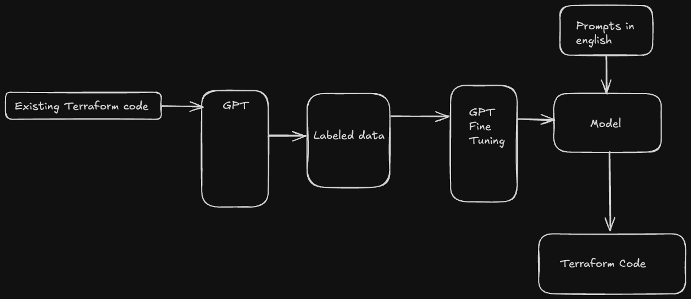

# Project Ideas

## 1. English to Terraform

### Overview
This project aims to build a system that translates human-readable English descriptions of cloud infrastructure into Terraform code. The generated code can then be used to provision and manage infrastructure resources in an automated manner.

### Features
- Translate English sentences into Terraform configurations.
- Support for common cloud providers such as AWS, Azure, and GCP.
- Utilizes GPT-based models like Mistral or Huggingface for natural language processing.

### Stack
- **Language Model**: GPT (Mistral / Huggingface)
- **Dataset**: Open Source Terraform code available on GitHub

### Steps for Development
1. Collect a dataset of Terraform code from open-source repositories.
2. Fine-tune GPT models to generate Terraform code from English input.
3. Evaluate the output for accuracy and correctness.
4. Create a validation system to ensure the generated code is syntactically and semantically correct.
5. Implement deployment features for practical use cases.

### Future Enhancements
- Add support for additional cloud providers.
- Integrate a graphical user interface for user input and visualized output.

## 2. AI Watermarking

- Watermarking refers to the process of embedding a non perceptible to human symbol or set of symbols or patterns to confirm that a given output is generated by a known source
- The goal is to implement an architecture to watermark AI output which can be verified by another algorithm, which should be built as part of the watermarking architecture as well

## 3. Fastest Way to your University

- Usually, there are multiple ways of transport to university as a student, taking Northeastern and UIC as examples, we have our own university shuttles along with public transportation and local bike sharing like divvy
- We can consume data from apis of university shuttles and apis of public transport (Chicago Transport Authority and Boston for example) we can optimise the path a student can take to reach campus on time
- A unique feature could include co ordinating bus and shuttle switches, google maps does not take into account the arrival time of a connecting bus and does not consume data from university shuttles (like UIC Ride and RedEye for UIC and NEU)

## 4. Public transport visualisation
- Inspiration from https://github.com/geohacker/bmtc
- Need to check for available APIs/data
- Can start with Chicago/Boston
